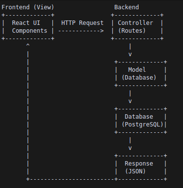

# 🎓 Mentor Management System

A comprehensive platform for managing mentor-mentee relationships, feedback, and scheduling in an educational environment.

## ✨ Key Features

### 🔐 Authentication & Security

- **JWT-based Authentication**

  - Secure token generation and validation
  - Role-based access control (RP/Admin and Mentor roles)
  - Token storage in localStorage
  - Automatic role-based redirects

- **Protected Routes**
  - Route guards for authenticated access
  - Role-specific navigation
  - Persistent sessions
  - Secure logout mechanism

### 📊 Dashboard Features

- **Schedule Management**

  - Daily session overview
  - Status tracking (Upcoming/Completed)
  - Session duration and timing
  - Quick session creation

- **Doubts Tracker**

  - Priority levels (High/Medium/Low)
  - Status management (Pending/In-Progress/Resolved)
  - Filtering capabilities
  - Quick response system

- **Feedback System**
  - Google Forms style feedback interface
  - Once-per-day submission restriction
  - Comprehensive feedback categories:
    - Student engagement rating
    - Overall performance evaluation
    - Concerns and irregularities tracking
    - Positive notes
    - Suggestions for improvement
    - Additional comments
  - Real-time validation
  - Success notifications
  - Historical feedback tracking

### 🎨 UI Components

- **Modern Navigation**

  - Responsive navbar
  - Profile information display
  - Role-based menu items
  - Smooth logout process

- **Interactive Dashboard**

  - Tabbed interface
  - Card-based layout
  - Status indicators
  - Action buttons

- **Notification System**
  - Toast notifications
  - Error handling
  - Success messages
  - Loading states

## 🛠️ Technical Stack

### Frontend (mentor-management-frontend)

- React 19.1.0
- React Router DOM 7.6.2
- Axios 1.9.0
- Vite 6.3.5
- ESLint 9.25.0

### Backend (mentor-management-backend)

- Node.js
- Express
- JWT for authentication
- CORS enabled

## 🚀 Getting Started

### Prerequisites

- Node.js v22.14.0 or higher
- pnpm package manager
- Modern web browser

### Installation

1. **Clone the Repository**

   ```bash
   git clone [repository-url]
   cd mentor-management-system
   ```

2. **Frontend Setup**

```bash
cd mentor-management-frontend
pnpm install
   pnpm dev
```

Access at: http://localhost:5173

3. **Backend Setup**

```bash
cd mentor-management-backend
pnpm install
pnpm dev
```

Server runs at: http://localhost:4000

## 🔌 API Endpoints

### Authentication

- POST /api/login
  - Authenticates users
  - Returns: JWT token & user role
  - Handles: Invalid credentials

### Protected Routes

- GET /api/protected
  - Requires: Valid JWT token
  - Returns: User data
  - Handles: Authorization

## � Google Sheets API Setup

To use the Google Sheets integration, you'll need to set up the Google Sheets API and obtain the necessary credentials.

### 1. Get Google Sheet ID

1. Open your Google Sheet
2. The Sheet ID is the long string in the URL between `/d/ and `/edit`
   - Example: `https://docs.google.com/spreadsheets/d/YOUR_SHEET_ID/edit#gid=0`

### 2. Enable Google Sheets API

1. Go to [Google Cloud Console](https://console.cloud.google.com/)
2. Create a new project or select an existing one
3. Enable the Google Sheets API:
   - Navigate to "APIs & Services" > "Library"
   - Search for "Google Sheets API"
   - Click "Enable"

### 3. Create API Credentials

1. Go to "APIs & Services" > "Credentials"
2. Click "Create Credentials" > "API key"
3. Restrict the API key for security:
   - Click on the created API key
   - Under "Application restrictions", select "HTTP referrers"
   - Under "API restrictions", select "Restrict key" and choose "Google Sheets API"
   - Click "Save"

### 4. Configure Environment Variables

Create a `.env` file in the frontend directory with your credentials:

```env
REACT_APP_GOOGLE_SHEETS_API_KEY=your_api_key_here
REACT_APP_GOOGLE_SHEET_ID=your_sheet_id_here
```

### 5. Share Your Google Sheet

1. Open your Google Sheet
2. Click "Share" in the top-right corner
3. Add the email address from your Google Cloud project's service account
4. Set the permission to "Editor"

### Security Notes

- Never commit your API key to version control
- Always restrict your API key to specific domains and APIs
- Regularly rotate your API keys in production

## �💅 Styling Features

- Responsive design
- Modern UI components
- Interactive elements
- Form validation styles
- Loading animations
- Mobile-first approach

## 🔒 Security Measures

- JWT authentication
- Protected endpoints
- Secure password handling
- CORS configuration
- HTTP-only cookies (planned)

## 🛣️ Roadmap

- [ ] User registration system
- [ ] Password reset functionality
- [ ] Enhanced profile management
- [ ] Advanced session handling
- [ ] Real-time notifications
- [ ] File sharing capabilities
- [ ] Video call integration

## 🤝 Contributing

1. Fork the repository
2. Create your feature branch
3. Commit your changes
4. Push to the branch
5. Submit a pull request

## 👥 Contributors

- Saketh
- Charan
- Reddy Raju
- Kushal
- Manikanta

## 📄 License

This project is licensed under the ISC License.

## 🐛 Known Issues

- Session timezone handling improvements needed
- Mobile view optimizations pending
- Real-time updates to be implemented

## 📞 Support

For support or queries:

- Create an issue in the repository
- Contact: [support-email]
- Join our developer community

## 🙏 Acknowledgments

- UI design inspiration from modern dashboards
- Open source community
- All contributors and testers

--

### Here's a visual representation of how MVC works in our application:



nvm install --lts Install latest LTS Node.js
nvm install node Install latest available Node.js
nvm use --lts Use latest LTS version
nvm use node Use latest version
nvm alias default node Set latest as default
node -v Check current version
